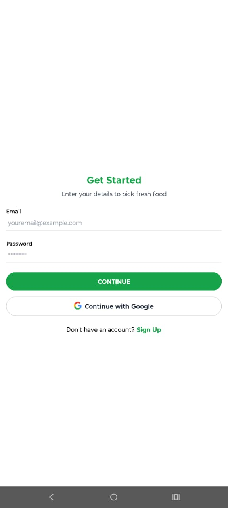
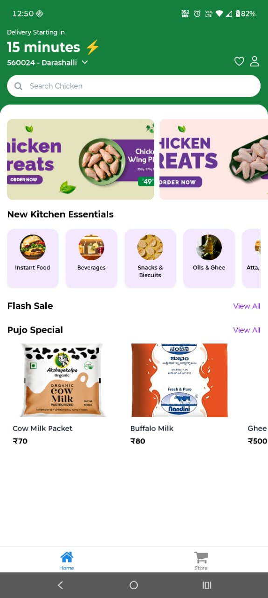
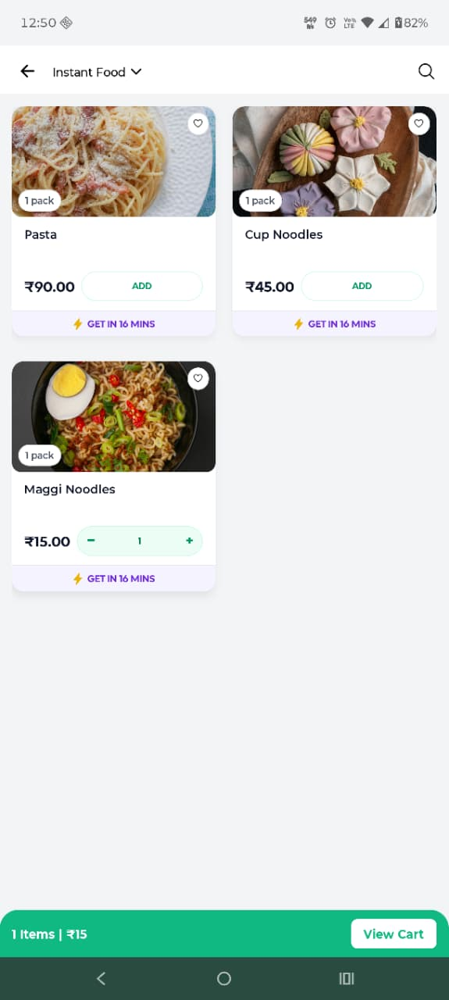
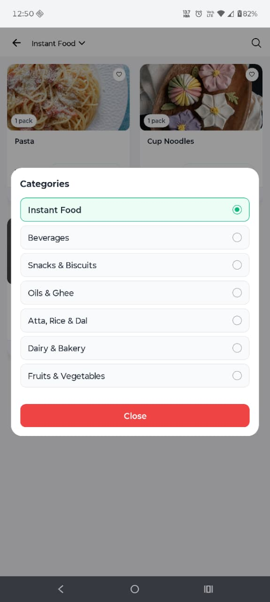
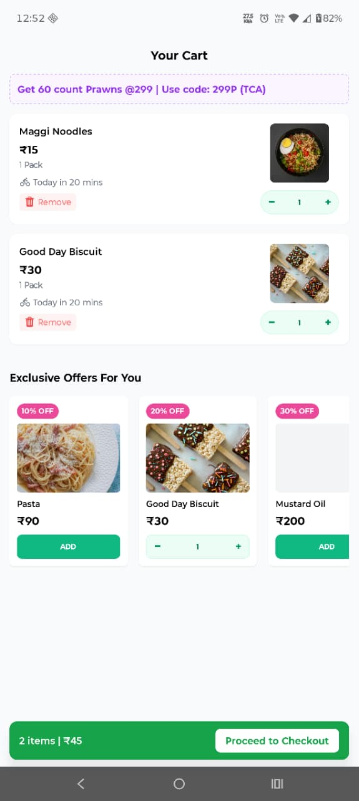
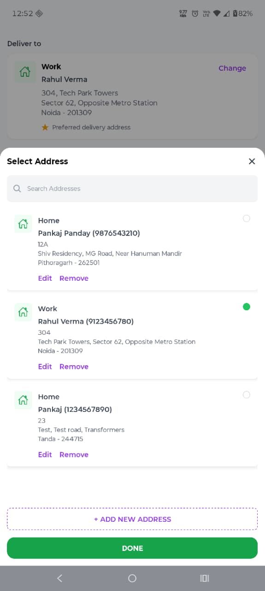
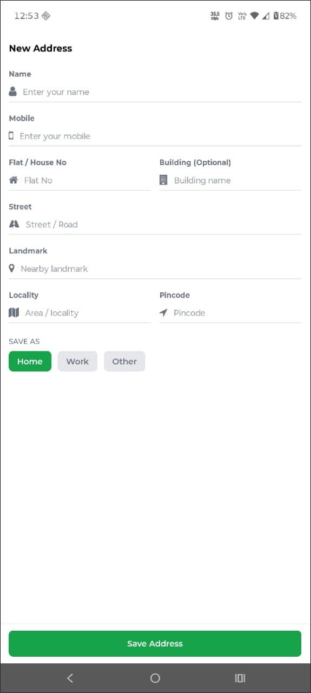
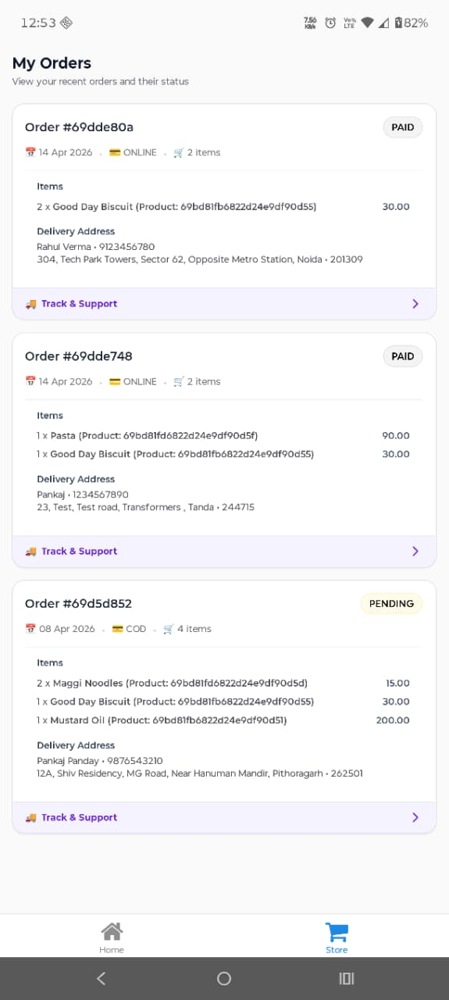
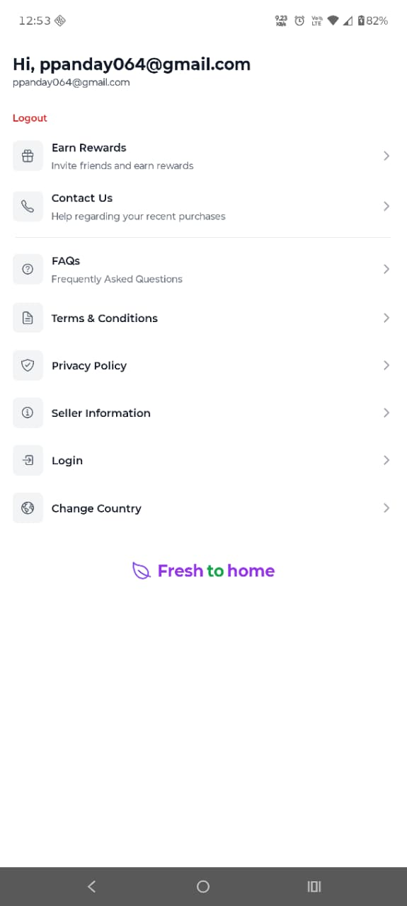

# FreshMeals

FreshMeals is a mobile e-commerce application built with React Native for ordering fresh food and groceries. It features a modern user interface, robust state management, and a complete checkout and payment flow.

## Demo


## Screenshots

| Login                       | Home                       | Category                       |
| --------------------------- | -------------------------- | ------------------------------ |
|  |  |  |

| Category Select                       | Cart                       | Address                       |
| ------------------------------------- | -------------------------- | ----------------------------- |
|  |  |  |

| Add Address                       | My Orders                       | Profile                       |
| --------------------------------- | ------------------------------- | ----------------------------- |
|  |  |  |

## Features

- **User Authentication**: Secure sign-up, login, and Google Sign-in functionality.
- **Product Discovery**: Browse products by category, search for specific items, and view exclusive deals.
- **Shopping Cart**: Add/remove items, update quantities, and view cart totals.
- **Address Management**: Add, select, and manage multiple delivery addresses.
- **Checkout Flow**: A multi-step checkout process including address selection, delivery slot choice, and payment method selection.
- **Payment Integration**: Supports both Cash on Delivery (COD) and Online Payments via Razorpay.
- **Order History**: View a list of past orders with their status, items, and delivery details.
- **Profile Management**: View user details and log out.

## Tech Stack

- **Framework**: React Native
- **Language**: TypeScript
- **Styling**: Tailwind CSS with NativeWind
- **State Management**: Zustand
- **Data Fetching & Caching**: TanStack Query (React Query)
- **Navigation**: React Navigation (Stack & Tabs)
- **API Client**: Axios
- **Form Handling**: React Hook Form
- **Authentication**: `@react-native-google-signin/google-signin`
- **Payments**: `react-native-razorpay`

## Project Structure

The codebase is organized into a modular and scalable structure within the `src` directory:

```
src/
├── api/          # API layer for services, endpoints, and Axios configuration.
├── components/   # Reusable UI components.
├── navigation/   # Navigation logic, stacks, and tab navigators.
├── screens/      # Top-level screen components.
├── store/        # Global state management with Zustand stores.
├── types/        # TypeScript type definitions and interfaces.
└── utils/        # Utility functions and helpers.
```

## Getting Started

Follow these instructions to get the project up and running on your local machine.

### Prerequisites

- Node.js (>= 20)
- Watchman
- React Native CLI
- JDK
- Android Studio (for Android) / Xcode (for iOS)

Please follow the official [React Native environment setup guide](https://reactnative.dev/docs/environment-setup) for detailed instructions.

### Installation & Setup

1.  **Clone the repository:**

    ```bash
    git clone https://github.com/pankaj-panday/mealapp.git
    cd mealapp
    ```

2.  **Install dependencies:**

    ```bash
    npm install
    # or
    yarn install
    ```

3.  **Set up environment variables:**
    Create a `.env` file in the root directory of the project and add the following environment variables. Replace the placeholder values with your actual keys.

    ```env
    API_BASE_URL=http://your-backend-api-url
    RAZORPAY_KEY_ID=your_razorpay_key_id
    RAZORPAY_KEY_SECRET=your_razorpay_key_secret
    GOOGLE_CLIENT_ID=your_google_web_client_id
    GOOGLE_CLIENT_ID_ANDROID=your_google_android_client_id
    ```

4.  **For iOS only, install Pods:**
    ```bash
    cd ios && pod install
    ```

### Running the Application

1.  **Start the Metro bundler:**
    Open a terminal in the project root and run:

    ```bash
    npm start
    ```

2.  **Run on a device or emulator:**
    Open a second terminal and run one of the following commands:
    - **For Android:**

      ```bash
      npm run android
      ```

    - **For iOS:**
      ```bash
      npm run ios
      ```
